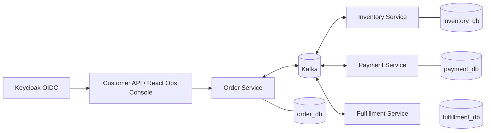

# SagaHarbor

**Event-driven order fulfillment and operations platform**

SagaHarbor follows an order across inventory reservation, payment authorization, and warehouse fulfillment. Four Spring Boot services exchange Kafka events; a React console gives operators a live view of orders, incidents, messaging backlogs, and recovery actions.


[](LICENSE)

<p align="center">
  
</p>

*The overview uses seeded fictional demo data. [Live Messaging captures](docs/DEMO.md#where-evidence-is-stored) show the console connected to all four backend services and Keycloak.*

## What the platform does

| Workflow | Implementation |
|---|---|
| Order processing | Idempotent placement, inventory reservation, deterministic payment authorization, and warehouse state transitions |
| Failure recovery | Transactional outbox, idempotent inbox, bounded Kafka retries, persisted dead letters, and admin-controlled replay |
| Operations | Work queue, order timeline, incident actions, SLA and inventory signals, CSV export, and messaging backlog views |
| Access control | Keycloak OIDC login with CUSTOMER, OPERATOR, and ADMIN roles checked by Spring Security and service-level ownership rules |
| Observability | OpenTelemetry trace propagation, Prometheus metrics, Grafana dashboards, and Tempo traces |

The payment component uses a deterministic simulator, and all users, orders, products, credentials, and financial outcomes are fictional demo data.

## Architecture

Each service owns a PostgreSQL database and publishes versioned JSON Schema events through Kafka. A transactional outbox connects business state changes to event publication. Consumers use an inbox keyed by event ID and consumer name to deduplicate redelivery.



1. Order Service accepts an idempotent order request and writes `OrderPlaced.v1` with the order in one transaction.
2. Inventory Service reserves stock and emits `InventoryReserved.v1`.
3. Payment Service authorizes the simulated payment and emits `PaymentAuthorized.v1`.
4. Fulfillment Service assigns warehouse work and advances it through `PICKING → PACKED → DISPATCHED → DELIVERED`.
5. Order Service consumes the resulting events to update its order and operations views. Cancellation invokes stock release, refund, and fulfillment compensation as needed.

See the [architecture](docs/ARCHITECTURE.md) and [event catalog](docs/EVENT_CATALOG.md) for state transitions and event contracts.

## Messaging operations

The Messaging console combines each service's unpublished outbox count and persisted dead letters in one view. A failed consumer message retains its event envelope and original topic for inspection. Kafka retry and dead-letter topics are isolated by consumer service, so one service's failure stays visible in the right queue.

| Role | Messaging action |
|---|---|
| OPERATOR | Inspect service backlog and dead-letter metadata |
| ADMIN | Inspect, confirm, and replay a stored event by ID |

The replay path publishes the persisted payload and records the attempt. The [live browser walkthrough](docs/DEMO.md#where-evidence-is-stored) checks both roles against running services, then verifies Inventory's dead-letter status, inbox, stock reservation, and `InventoryReserved` event in PostgreSQL.


## Technology stack

| Layer | Technologies |
|---|---|
| Backend | Java 21, Spring Boot 4.1, Spring Security, Spring Data JPA, Flyway |
| Frontend | React 19, TypeScript, Vite, TanStack Query |
| Messaging and storage | Kafka, PostgreSQL, Redis |
| Identity | Keycloak, OIDC, OAuth2 Resource Server |
| Observability | OpenTelemetry, Micrometer, Prometheus, Grafana, Tempo |
| Local deployment | Docker Compose, Kubernetes kind, Kustomize |
| Verification | JUnit 5, Testcontainers, Vitest, Playwright, k6 |

## Run locally

Prerequisites: Docker, JDK 21, Node.js 20+, Python 3, and `make`. Maven is included through `./mvnw`.

```bash
cp .env.example .env
make infra-up
scripts/seed-demo-data.sh
make demo-up
cd apps/ops-console
npm ci
npm run dev
```

Open `http://localhost:5173`. The seed command creates representative orders and incidents through the HTTP APIs; the Docker demo then runs the four services against the same local data.

| Demo role | Username | Password |
|---|---|---|
| Operator | `operator.demo` | `OperatorDemo!123` |
| Admin | `admin.demo` | `AdminDemo!123` |

These credentials are for the local fictional realm. [`docs/DEMO.md`](docs/DEMO.md) walks through the console and failure scenarios. For a local Kubernetes run, start the infrastructure and use `make kind-up`; [infrastructure instructions](infra/README.md) describe the kind overlay.

## Verify

```bash
./mvnw -B verify              # backend unit, integration, and coverage checks
cd apps/ops-console
npm ci
npm test                      # Vitest
npm run build                 # TypeScript and production bundle
npm run e2e                   # Playwright demo workflows
```

Local verification on 2026-09-30 passed the backend `verify` lifecycle, all 19 frontend unit tests, nine demo-mode browser tests, and one browser test connected to the running backend services. The [testing guide](docs/TESTING.md) documents the coverage gate, integration cases, and measured local load scenarios. Repository hygiene and documentation links are checked by `make audit`.

## Repository map

| Path | Contents |
|---|---|
| [`services/`](services/) | Order, Inventory, Payment, and Fulfillment APIs |
| [`apps/ops-console/`](apps/ops-console/) | React operations console |
| [`contracts/`](contracts/) | JSON Schema event contracts |
| [`infra/`](infra/) | Compose stack, kind manifests, and Keycloak demo realm |
| [`tests/`](tests/) | Failure scenarios and k6 scripts |
| [`docs/`](docs/) | Architecture, runbooks, evidence, and implementation scope |

## License

Released under the [MIT License](LICENSE). Third-party copyright and permission notices are preserved in [NOTICE](NOTICE).
